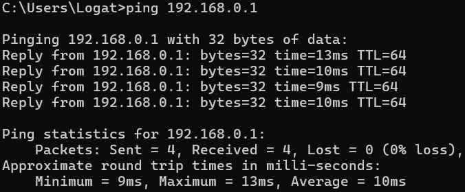
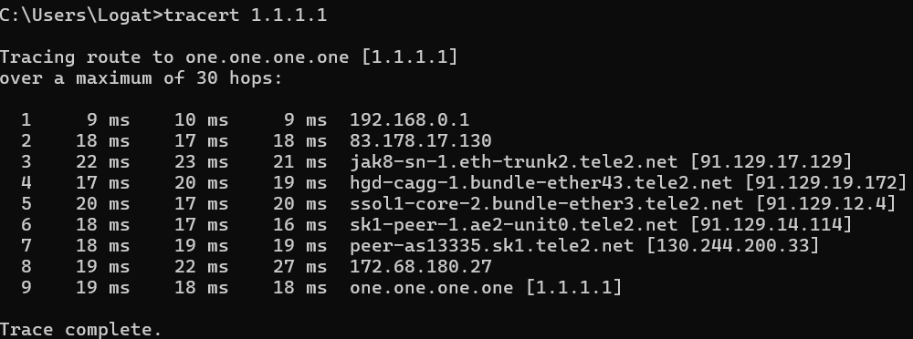
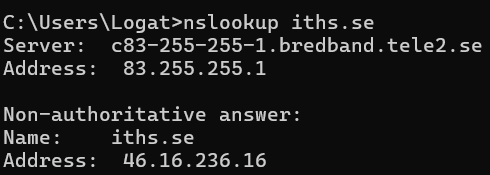

# Laborationsrapport: Vecka 1 – [Ahmed Mohamed Ali]
**Kurs:** Operativsystem – Linux och Windows, 35 YHP
**Moment:** Laborationer Vecka 1 (Nätverk, Virtualisering, Windows-konfiguration & Behörigheter)
**Datum för genomförande:** [01-09-26]
**Studerande:** [Ahmed Mohamed Ali]

---

> ### ⚠️ STUDERANDEINSTRUKTION & AI-POLICY (IT-HÖGSKOLAN v2.0)
> Denna mall är utformad för att hjälpa dig strukturera din laborationsrapport på ett professionellt sätt i enlighet med **IT-Högskolans AI-policy (v2.0)**. 
> 
> * **Självständigt arbete:** Du måste själv genomföra de praktiska momenten i din virtuella maskin (VM) och skriva alla svar med egna ord. Kopiera eller omformulera inte AI-genererad text direkt i rapporten.
> * **Muntlig förklaring:** Du har fullt ansvar för innehållet och ska kunna förklara alla kommandon, resultat och begrepp muntligt om din utbildare ber om det.
> * **Redovisning av AI:** I slutet av rapporten finns ett obligatoriskt avsnitt ("Bilaga: Redovisning av AI-användning") där du kort beskriver hur du har använt AI som stöd (t.ex. som strukturstöd eller för att förstå svåra begrepp).

---

## 1. Systemmiljö (Prerequisites)
*Beskriv din labbmiljö och de maskiner du har använt för att genomföra laborationerna.*

*   **Fysisk värddator (Host):** Windows 11 Pro, 32 GB RAM, AMD Ryzen 7 PRO 5850
*   **Hypervisor:** VMware Workstation Pro v17
*   **Virtuella gästmaskiner (Guests):**
    *   *SRV-1 (Server):* Windows Server 2025 Desktop Experience, 8 GB RAM, 2 CPU-kärnor
    *   *CLNT-1 (Klient):* Windows 11 Pro, 8 GB RAM, 2 CPU-kärnor

---

## 2. Del 1: Nätverk från kommandotolken (Övning - Nätverk)
*Genomför övningarna på din fysiska dator och dokumentera dina unika resultat.*

### 2.1 Genomförande & Loggade värden
Kör `ipconfig /all` på din värddator och fyll i dina värden nedan:

*   **Min IP-adress (IPv4):** `[192.168.0.153]`
*   **Nätmask (Subnet Mask):** `[255.255.255.0]`
*   **Standard-gateway (Default Gateway):** `[192.168.132.1]`
*   **DNS-server:** `[1.1.1.1]`
*   **Hittade du VMware-adaptrarna VMnet1 och VMnet8? Vilka IP-adresser har de?**
    *   *Svar:* `Ja, VMnet 1 har IP-adress 192.168.12.1 och VMnet 8 har IP-adress 192.168.142.1`

### 2.2 Felsökningskommandon och verifiering
Beskriv kortfattat vad som hände på din skärm när du körde följande kommandon och lägg till dina skärmdumpar under respektive punkt:

1.  **`ping [192.168.132.1]`**
    *   *Resultat & Observation:* `Gatewayen pingades med 4 packet`
        

2.  **`tracert 1.1.1.1`**
    *   *Resultat & Observation:* `Visar hoppen nätverkspaketen gör för sig ut till internet`
    *   
        

3.  **`netstat -ano`**
    *   *Resultat & Observation:* `En lista med alla nätverksanslutningar poppade upp, jag kan se vilkar portar som lyssnar och är öppna.`


4.  **`nslookup iths.se`**
    *   *Resultat & Observation:* `Kommadot visar vilken Ip-adress "iths.se" har.`

        

5.  **`ipconfig /flushdns`**
    *   *Resultat & Observation:* `Kommandot rensar "DNS resolver Cache"`

### 2.3 Teoretiska frågor (Nätverksgrunder)
*Besvara frågorna baserat på dina egna observationer under nätverksövningen.*

1.  **Vad är skillnaden mellan din IP-adress och din gateway?**
    *   *Svar:* `IP-adressen är min enhets unika identifierare på mitt nätverk, medan gatewayen är till för att nå andra nätverk utanför mitt egna.`
2.  **Hur många hopp gick trafiken innan den nådde målet (1.1.1.1), och vad är det första hoppet?**
    *   *Svar:* `Det tog 9 hopp, det första hoppet var till "83.178.17.130" `
3.  **I `netstat -ano` — vad står numret i sista kolumnen för, och hur tar du reda på vilket program det är?**
    *   *Svar:* `Numret står för Process ID (PID). Operativsystemet tilldelar alla processer på datorn ett unikt PID. Du kan kopiera PID-numret och klistra in det under detaljer i Aktivitetshanteraren (Task Manager) för att veta vilket program det är.
`
4.  **Varför har du en MAC-adress när du redan har en IP-adress?**
    *   *Svar:* MAC-adressen är som enhetens personnummer; den ändras aldrig och är hårdkodad på ditt nätverkskort. IP-adressen talar om var du befinner dig på nätverket just nu, och den kan ändras beroende på vilket nätverk du kopplar upp dig till.
`

---

## 3. Del 2: Virtualisering & nätverkslägen (Övning - Virtualisering)
*Genomför övningarna inuti VMware Workstation Pro och observera hur nätverksinställningarna påverkar dina gästdatorer.*

### 3.1 Snapshots (Säkerhetssteg)
*   **Tog du en snapshot innan du påbörjade nätverkstesterna? Vad döpte du den till?**
    *   *Svar:* `Ja, jag döpte den till "Clean install"`
*   **Vad tror du händer med snapshotet om du senare installerar program i din VM och därefter gör en rollback (återställning)?**
    *   *Svar:* `Jag tror att den virtuella maskinen (VM) återställs till de inställningar den hade vid tidpunkten då snapshoten togs och programmet försvinner.
`
*   **Varför är en snapshot inte samma sak som en backup?**
    *   *Svar:* `En snapshot lagras på samma ställe som virtuella maskinen och om hårddisken blir komprimerad kan det hända att du förlorar både VMen och snapshoten. En backup ska lagras på en annan enhet.`

### 3.2 Nätverksmatris (Egna observationer)
*Testa de tre nätverkslägena inuti din VM och fyll i matrisen utifrån vad du faktiskt observerar (Ja/Nej):*

*   **NAT-läge**
    *   VM:ens IP-nät: `192.168.142.130`
    *   Kan pinga värddatorn? `Ja`
    *   Kan pinga 8.8.8.8 (Internet)? `Ja`
    *   Kan pinga en klasskamrats VM? `Nej`
*   **Host-only-läge**
    *   VM:ens IP-nät: `192.168.12.129`
    *   Kan pinga värddatorn? `Nej`
    *   Kan pinga 8.8.8.8 (Internet)? `Nej`
    *   Kan pinga en klasskamrats VM? `Nej`
*   **Bridged-läge (Bryggat)**
    *   VM:ens IP-nät: `192.168.134.11`
    *   Kan pinga värddatorn? `Nej, på grund av brandväggar.`
    *   Kan pinga 8.8.8.8 (Internet)? `Ja`
    *   Kan pinga en klasskamrats VM? `Nej, på grund av brandväggar.`

### 3.3 Provocerad felsökning (Lär genom att göra)
*Dokumentera vad som hände under dina felsökningstester inuti din VM:*

1.  **Test 1: "Dra ur sladden" (Avmarkera Connected i VMware-inställningarna)**
    *   *Vad visar `ipconfig` nu? Vilket är felmeddelandet?*
    *   *Svar:* `Ipconfig visar nu: Media State . . . . . . . . . . . : Media disconnected. Det finns ingen fysisk uppkoppling till nätverket, och därför försöker datorn inte skicka eller visa någon nätverksinformation.`
2.  **Test 2: "Fel nätverksläge" (Sätt till Host-only och försök nå internet)**
    *   *Hur skiljer sig detta fel från att "dra ur sladden"? Kan man se skillnad enbart genom att köra `ipconfig`?*
    *   *Svar:* I detta fall försöker datorn skicka ut paketet till internet, men den vet inte hur den ska bygga upp paketen eller var de ska ta vägen. Det skiljer sig från det första fallet (Test 1) där datorn inte ens försökte skicka paketen.
`
3.  **Test 3: "Fel IP-adress" (Sätt en manuell statisk IP på ett helt annat nät, t.ex. 10.99.99.5/24)**
    *   *Vad händer när du pingar din värddator eller din gateway?*
    *   *Svar:* `Jag får felmeddelandet "Destination host unreachable".Det går inte att pinga eftersom enheten ligger på fel IP-nät.`

### 3.4 Reflektionsfrågor (Virtualisering)
*Svara kortfattat med egna ord.*

1.  **Vad är skillnaden mellan värddator och gäst, och vilka hårdvaruresurser delar de på?**
    *   *Svar:* `Värden är den fysiska datorn som har den fysiska hårdvaran, medan gästen är den virtuella maskinen som körs på värddatorns resurser. De delar på processorkärnor (cores), RAM-minne och diskutrymme.
`
2.  **I NAT-läge har din VM internetanslutning men kan inte nås utifrån från det fysiska nätverket. Varför är det så?**
    *   *Svar:* `I NAT-läge ligger den virtuella maskinen bakom värddatorns IP-adress. Den virtuella maskinen kan skicka ut förfrågningar genom värddatorns IP-adress, men kan inte nås direkt utifrån eftersom den inte har en egen offentlig IP-adress på det fysiska nätverket.`
3.  **Varför får VM:en i bridged-läge en adress från samma nät som din vanliga dator?**
    *   *Svar:* `I bridged-läge omvandlas VM:en till sin egna "fysiska" dator som är separat från värden. Den kan kopplas till nätverket på egen hand och kan skicka och ta emot kommunikation självständigt.`
4.  **Vilket nätverksläge skulle du välja för en labbmiljö där två VM:ar ska prata med varandra men vara helt skyddade från internet? Varför?**
    *   *Svar:* `Host-only-läget är bäst eftersom det begränsar all kommunikation till att endast ske mellan de virtuella maskinerna och värddatorn.`
5.  **En snapshot tar nästan ingen plats när den skapas men växer med tiden. Varför är det så?**
    *   *Svar:* `Datorn måsta hålla redo på alla ändringar som har skett sän snapshoten skapades, ju mer ändringar du gör desto mer saker behöver snapshotten hålla koll på. `
6.  **Vad talar för och emot att köra kursens labbmiljö i molnet i stället för lokalt på laptopen?**
    *   *Svar:* `Du kan nå VM:en från vilken dator som helst och du har mer tillgång till mer kraftfulla hårdvaror. Men det kostar vanligtvist pengar att köra VM i clouden och du måste hela tiden vara uppkopllad.`

---

## 4. Del 3: Var konfigurerar man vad? (Övning - Gränssnitt)
*Dokumentera din jakt genom Windows olika administrationsgränssnitt.*

### 4.1 Verktygskartan (De 12 uppgifterna)
*Leta dig igenom Windows administrationsgränssnitt och fyll i dina svar under respektive uppgift. Hitta det snabbaste sättet.*

*   **Uppgift 1: Ta reda på datornamnet, och byt det till något eget**
    *   **Gränssnitt/familj:** `Inställningar`
    *   **Specifikt verktygsnamn:** `System > Om`
    *   **Snabbkommando (Win + R) eller CLI-kommando:** `ms-settings:about`
    

*   **Uppgift 2: Ta reda på exakt vilken Windows-version och build du kör**
    *   **Gränssnitt/familj:** `Inställningar `
    *   **Specifikt verktygsnamn:** `Om`
    *   **Snabbkommando (Win + R) eller CLI-kommando:** `ms-settings:about`
    

*   **Uppgift 3: Sätt en statisk IP-adress på nätverkskortet (och ställ tillbaka till DHCP)**
    *   **Gränssnitt/familj:** `Kontrollpanelen`
    *   **Specifikt verktygsnamn:** `Nätverksanslutningar`
    *   **Snabbkommando (Win + R) eller CLI-kommando:** `ncpa.cpl`
    

*   **Uppgift 4: Skapa en lokal användare och lägg den i gruppen Users**
    *   **Gränssnitt/familj:** `Datorhantering`
    *   **Specifikt verktygsnamn:** `Lokala användare och grupper`
    *   **Snabbkommando (Win + R) eller CLI-kommando:** `lusrmgr.msc`
    

*   **Uppgift 5: Ändra UAC-nivån ett steg (och återställ)**
    *   **Gränssnitt/familj:** `Kontrollpanelen`
    *   **Specifikt verktygsnamn:** `Ändra inställningar för User Account Control`
    *   **Snabbkommando (Win + R) eller CLI-kommando:** `UserAccountControlSettings`
    

*   **Uppgift 6: Ta reda på vilka tjänster som körs, och starta om Print Spooler**
    *   **Gränssnitt/familj:** `Windows Administrativa verktyg`
    *   **Specifikt verktygsnamn:** `Tjänster`
    *   **Snabbkommando (Win + R) eller CLI-kommando:** `services.msc`
    

*   **Uppgift 7: Hitta den senaste lyckade inloggningen i händelseloggen**
    *   **Gränssnitt/familj:** `Windows Administrativa verktyg`
    *   **Specifikt verktygsnamn:** `Event Viewer`
    *   **Snabbkommando (Win + R) eller CLI-kommando:** `eventvwr.msc`
    

*   **Uppgift 8: Se diskpartitioner och ledigt utrymme på C:**
    *   **Gränssnitt/familj:** `Diskhantering`
    *   **Specifikt verktygsnamn:** `Diskhantering`
    *   **Snabbkommando (Win + R) eller CLI-kommando:** `diskmgmt.msc`
    

*   **Uppgift 9: Ändra tidszon**
    *   **Gränssnitt/familj:** `Windows Inställningar`
    *   **Specifikt verktygsnamn:** `Datum och tid`
    *   **Snabbkommando (Win + R) eller CLI-kommando:** `timedate.cpl`
    

*   **Uppgift 10: Visa filändelser och dolda filer i Utforskaren**
    *   **Gränssnitt/familj:** `Utforskaren`
    *   **Specifikt verktygsnamn:** `Mappalternativ`
    *   **Snabbkommando (Win + R) eller CLI-kommando:** `control folders`
    

*   **Uppgift 11: Se program som startar automatiskt när datorn startar**
    *   **Gränssnitt/familj:** `Aktivitetshanteraren`
    *   **Specifikt verktygsnamn:** `Aktivitetshanteraren / Autostart-appar`
    *   **Snabbkommando (Win + R) eller CLI-kommando:** `taskmgr`
    

*   **Uppgift 12: Se installerade program och avinstallera ett**
    *   **Gränssnitt/familj:** `Kontrollpanelen`
    *   **Specifikt verktygsnamn:** `Program och funktioner`
    *   **Snabbkommando (Win + R) eller CLI-kommando:** `appwiz.cpl`
    

### 4.2 Samma sak på tre ställen (Teori)
1.  **När du ändrade datornamn via Inställningar (Settings), kastades du över till det gamla gränssnittet eller stannade du kvar?**
    *   *Svar:* `Jag stannade kvar i inställningar. Jag behövde inte gå över till det gamla gränssnittet.`
2.  **Varför tror du Microsoft har kvar två helt parallella gränssnitt (Settings och Kontrollpanelen)?**
    *   *Svar:* `Settings har saknar många gamla funktioner som inte har flyttats över till det nya gränssnittet. Kontrollpanelen har även många avancerade inställningar som en vanligt användare inte skulle ha behov av. `
3.  **Vilken av de tre vägarna (Inställningar, sysdm.cpl eller PowerShell) skulle du välja om du skulle döpa om 50 datorer och varför?**
    *   *Svar:* `PowerShell eftersom den ger dig möjligheten att skripta namnbyten. Det skulle spara på tid och minska risken för att göra fel.`

### 4.3 Titta i registret (Under huven)
Öpna Registereditorn (`regedit`) på din gäst-VM och besvara följande frågor:

1.  **Du navigerade till `HKCU\Software\Microsoft\Windows\CurrentVersion\Explorer\Advanced`. Stämde värdet på `HideFileExt` överens med hur du ställde in filändelser i Utforskaren?**
    *   *Svar:* `Ja, värdet var 0 vilket betyder att funktionen "HideFileExt" är avstängd`
2.  **Vad hittade du under nyckeln `HKCU\Software\Microsoft\Windows\CurrentVersion\Run`? Matchar det listan över autostartande program?**
    *   *Svar:* `De flesta program som finns under Autostart i taskmanager är också listade i registret men inte alla, jag tror det beror på att de är drivrutiner.`
3.  **Varför ska man alltid exportera (ta backup på) en registernyckel innan man gör ändringar direkt i registret?**
    *   *Svar:* `I registret finns det ingen ångerknapp. Om du råkar radera eller ställa in fel värde på en nyckel så kan operativ systemet krasha eller vägra starta nästa gång. Om något skulle gå fel kan du köra din backup och återställa inställningarna. `

### 4.4 Bygg din egen MMC-konsol
1.  **Vilka fördelar upptäckte du med att bygga en egen samlad MMC-konsol (`Mina verktyg.msc`) jämfört med att öppna flera separata administrationsverktyg?**
    *   *Svar:* `Jag spararde "Mina verktyg på mitt skrivbord vilket gjorde det mycket enklare att sätta igång med ändringar på datorn. Det sparar mycket tid och det är snabbare att hitta rätt. Du kan även bygga verklådor anpassade för olika saker beroende på vilka uppgifter du har. `
2.  **Om du försöker lägga till en snap-in som pekar mot en annan dator i nätverket istället för den lokala datorn, vad krävs rent nätverks- och säkerhetsmässigt för att det ska fungera?**
    *   *Svar:* `Datorerna måste kunnas kopplas samman på ett nätverk och datorn som gör ändringarna måste har admin behörigheter för att kunna agera.`

### 4.5 Reflektionsfrågor (Windows navigering)
*Svara kortfattat med egna ord.*

1.  **Vilken av de fem familjerna hamnade flest av de 12 uppgifterna i? Blev du förvånad?**
    *   *Svar:* `Det var jämnt mellan inställningarna och kontroll panelen. Det är logiskt, eftersom de flesta grundläggande ändringarna går att göra enklare via dessa gränssnitt. De övriga har färre användningsfall men är mer specialiserade för vissa ändamål. `
2.  **Vilka uppgifter gick inte att lösa alls i det moderna gränssnittet (Settings)?**
    *   *Svar:* `Uppgift 1, 2, 3, 9, 11, och 12. De behövde mer specialiserade funkotioner vilket tog mig till ett annat gränssnitt.`
3.  **Vad är fördelen med en MMC-konsol jämfört med Kontrollpanelen?**
    *   *Svar:* `[Skriv med egna ord...]`
4.  **Varför ska man vara extremt försiktig i registret när exakt samma ändring oftast går att göra i ett grafiskt gränssnitt?**
    *   *Svar:* `[Skriv med egna ord...]`
5.  **Om du skulle utföra dessa inställningar på 100 datorer samtidigt i en företagsmiljö, vilken metod/familj är den enda rimliga och varför?**
    *   *Svar:* `[Skriv med egna ord...]`
6.  **Windows Server har generellt färre saker i Inställningar (Settings) än en vanlig klient (Windows 11). Varför tror du att Microsoft har valt att göra så?**
    *   *Svar:* `[Skriv med egna ord...]`

---

## 5. Del 4: Utforska DNS med nslookup (Övning - DNS)
*Genomför DNS-undersökningarna på din egen maskin och dokumentera dina unika observationer.*

### 5.1 Genomförande & Loggade DNS-värden

*   **Del 1: Slå upp en domän (A-post)**
    *   Hur många IP-adresser fick du tillbaka för `www.google.com`? `[Skriv här...]`
    *   Ändras ordningen på adresserna när du kör kommandot flera gånger? Vad tror du att det beror på? `[Skriv med egna ord...]`
    *   Hur många IP-adresser fick du tillbaka för `iths.se`? `[Skriv här...]`

*   **Del 2: Reverse lookup (PTR-post)**
    *   Vilket namn får du när du kör `nslookup 8.8.8.8`? `[Skriv här...]`
    *   Vad händer när du kör nslookup på en av IP-adresserna du fick för `www.google.com`? Får du en felkod eller ett annat namn (t.ex. 1e100.net)? `[Skriv din observation här...]`
    *   Varför fungerar `8.8.8.8` så konsekvent för reverse lookup medan vanliga webbadressers IP-adresser ofta inte gör det? `[Skriv med egna ord...]`

*   **Del 3: E-postservrar (MX-post)**
    *   Vad styr siffran framför servernamnen (t.ex. 5, 10, 20) i MX-svaret? `[Skriv med egna ord...]`
    *   Vilken e-postleverantör använder IT-Högskolan för `iths.se` och hur ser du det i din nslookup-utskrift? `[Skriv ditt svar och din motivering här...]`

*   **Del 4: Namnservrar (NS-post)**
    *   Hur många namnservrar har `skolverket.se`? `[Skriv här...]`
    *   Hur många namnservrar har `iths.se`? `[Skriv här...]`
    *   Varför har man alltid fler än en namnserver för en domän? `[Skriv med egna ord...]`
    *   Driver organisationerna (Skolverket och IT-Högskolan) sina namnservrar själva eller ligger de hos externa leverantörer? Hur ser du det på namnen? `[Skriv ditt svar och din motivering här...]`

*   **Del 5: Alias (CNAME-post)**
    *   Vad pekar aliaset `www.microsoft.com` på? `[Skriv här...]`
    *   Varför väljer Microsoft att skicka sina besökare till en extern CDN-leverantör istället för en egen fysisk server? `[Skriv med egna ord...]`

*   **Del 6: TXT-poster och SPF**
    *   Leta upp SPF-posten för `iths.se` (börjar med `v=spf1`). Hur många olika betrodda tjänster eller IP-nät listas i den? `[Skriv här...]`
    *   Varför är det en stor säkerhetsrisk om en SPF-lista blir för lång eller om den slutar med parametern `+all`? `[Skriv med egna ord...]`

*   **Del 7: Fråga en annan DNS-server**
    *   Fick du exakt samma IP-adresser till `www.google.com` när du frågade DNS-servern `1.1.1.1`? `[Skriv här...]`
    *   Vad händer med raden "Non-authoritative answer" när du frågar domänens egen namnserver direkt? Varför blir det så? `[Skriv med egna ord...]`

*   **Del 8: När det inte fungerar (Felsökning)**
    *   Vilket felmeddelande indikerar att domänen inte existerar överhuvudtaget (NXDOMAIN)? `[Skriv här...]`
    *   Vilket meddelande indikerar att domänen finns men saknar den specifika posttypen du sökte efter? `[Skriv här...]`
    *   Vilket meddelande får du när DNS-servern inte svarar alls (Timeout)? `[Skriv här...]`
    *   Om en användare ringer supporten och säger att en webbplats inte fungerar, vilket av dessa tre fel tyder på en felstavning och vilket tyder på att DNS-servern ligger nere? `[Skriv med egna ord...]`

*   **Del 9: DNS-cachen på din dator**
    *   Vad låg i din lokala DNS-cache innan du körde `ipconfig /flushdns`? `[Skriv här...]`
    *   Varför syns inte de namn du just sökt efter med `nslookup` i Windows lokala DNS-cache (`ipconfig /displaydns`)? `[Skriv med egna ord...]`

### 5.2 Reflektionsfrågor (DNS)
*Svara kortfattat med egna ord.*

1.  **Vad är skillnaden i funktion mellan A-, PTR-, MX-, NS-, CNAME- och TXT-poster?**
    *   *Svar:* `[Skriv med egna ord...]`
2.  **Vad betyder begreppet "Non-authoritative answer", och i vilket specifikt scenario får du ett auktoritativt svar?**
    *   *Svar:* `[Skriv med egna ord...]`
3.  **Vad kan en utomstående angripare ta reda på om en organisation enbart genom att göra publika DNS-uppslagningar?**
    *   *Svar:* `[Skriv med egna ord...]`
4.  **TTL (Time to Live) anger hur länge ett DNS-svar får sparas i en cache. Vad bör du göra med TTL-värdet i god tid innan du flyttar en webbplats eller e-posttjänst till en ny server, och varför?**
    *   *Svar:* `[Skriv med egna ord...]`
5.  **Vad slutar fungera i ett nätverk om DNS-tjänsten går ner helt — och vilka saker fortsätter faktiskt att fungera?**
    *   *Svar:* `[Skriv med egna ord...]`
6.  **Varför är DNS-systemet ett så otroligt vanligt mål för cyberangrepp?**
    *   *Svar:* `[Skriv med egna ord...]`

---

## 6. Del 5: NTFS-behörigheter med icacls (Övning - NTFS)
*Genomför behörighetsändringarna inuti din virtuella Windows-maskin och dokumentera stegen.*

### 6.1 Praktiskt genomförande
Kör kommandona i din VM och logga de begärda värdena:

1.  **Skapa mappen Labb och filen hemlig.txt:**
    ```cmd
    mkdir Labb && echo Hemligt > Labb\hemlig.txt
    ```
2.  **Skapa testkontot:**
    ```cmd
    net user Testare Passw0rd! /add
    ```
3.  **Läs av de ursprungliga behörigheterna på hemlig.txt innan du gör några ändringar:**
    ```cmd
    icacls Labb\hemlig.txt
    ```
    *   *Mina loggade ursprungliga behörigheter:* `[Klistra in eller skriv behörigheterna här]`

4.  **Ge kontot Testare läsrätt (R) på filen:**
    ```cmd
    icacls Labb\hemlig.txt /grant Testare:(R)
    ```
5.  **Bryt arvet på mappen Labb och behåll de ärvda posterna som explicita:**
    ```cmd
    icacls Labb /inheritance:d
    ```
6.  **Neka kontot Testare läsrätt (R) på filen:**
    ```cmd
    icacls Labb\hemlig.txt /deny Testare:(R)
    ```
7.  **Läs av behörigheterna på filen hemlig.txt igen:**
    ```cmd
    icacls Labb\hemlig.txt
    ```
    *   *Mina loggade behörigheter efter deny-regeln:* `[Klistra in eller skriv behörigheterna här]`

8.  **Dokumentera behörigheterna grafiskt:**
    *   *📸 Skärmdump på behörighetslistan från Säkerhetsfliken eller kommandotolken:*
        

9.  **Städa upp efter dig:**
    ```cmd
    icacls Labb\hemlig.txt /remove:d Testare
    net user Testare /delete
    rmdir /s Labb
    ```

### 6.2 Reflektionsfrågor (NTFS-behörigheter)
*Svara kortfattat med egna ord.*

1.  **Du tilldelade först en explicit tillåtelse (läsrätt) till kontot Testare och lade därefter till en explicit blockering (deny) för samma konto. Vilken regel vinner och varför?**
    *   *Svar:* `[Skriv med egna ord...]`
2.  **Vad betyder arvsflaggorna `(OI)` och `(CI)` i icacls-utskriften?**
    *   *Svar:* `[Skriv med egna ord...]`
3.  **Vad hände med de befintliga behörigheterna på filen `hemlig.txt` i samma ögonblick som du bröt arvet på föräldramappen `Labb`?**
    *   *Svar:* `[Skriv med egna ord...]`
4.  **Varför anses det allmänt inom systemsäkerhet vara betydligt farligare och mer svårfelsökt att arbeta med neka-regler (deny) än med enbart tillåt-regler (allow)?**
    *   *Svar:* `[Skriv med egna ord...]`

---

## 7. Bilaga: Redovisning av AI-användning
*Denna bilaga är obligatorisk enligt IT-Högskolans AI-policy (v2.0).*

1.  **Vilka AI-verktyg har du använt i samband med denna laboration?**
    *   *Svar:* `[Skriv här...]`
2.  **Vilken roll har AI haft i ditt arbete? (T.ex. förklarat svåra begrepp, hjälpt till med strukturen, agerat bollplank...)**
    *   *Svar:* `[Skriv här...]`
3.  **Hur har du själv bearbetat, kontrollerat och kvalitetssäkrat informationen som AI har bidragit med?**
    *   *Svar:* `[Skriv med egna ord, t.ex. \"Jag har kört alla kommandon i mina egna virtuella maskiner och loggat mina faktiska nätverks- och behörighetsvärden, samt formulerat alla svar i rapporten själv.\"]`
4.  **Spara de viktigaste prompts (instruktioner) du gav till AI-verktyget här:**
    *   *Mina prompts:*
        *   `[Klistra in prompt 1 här]`
        *   `[Klistra in prompt 2 här]`
